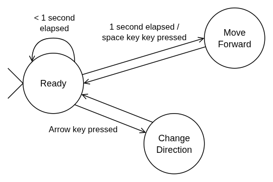

# Final Project: Reflection

ECE 2039 - C01
Andrew Suyer

## Introduction

This project was the end result of the Computational Engineering class at WPI. I had to apply the concepts that I learned in the last seven weeks to create this finite state machine simulation using the C programming language. 

As a computer science major, a lot of the material covered in the class was already familiar to me, namely, C programming and finite automata theory. However, this project allowed me to connect these two concepts in a way that I had never done before. As a result, I have strengthened my knowledge in both these topics.

## The end result

I will start by talking about the end result of the project: the simulation program. I'll mention what features turned out great as well as those features that could be improved.

The program works exactly as I hoped it would. All keyboard inputs work properly, and the program responds immediately when they are used, which is satisfying.

I am also happy with how the program looks. I fulfilled one of my "extra" goals of making a humanoid looking sprite as opposed to a single character sprite. The rendering cycle works nicely and follows a clear-draw-refresh cycle that is common in game development.

One thing I wish I handled differently was `DEBUG` mode. As I currently have it, you have enable/disable `DEBUG` mode at compile time. If enabled, the program will print log messages to `stderr`, however, this clutters up the screen if `stderr` isn't redirected to a file using `2>` bash syntax. Some possible solutions to this problem are:
- Write log messages to a file instead of `stderr`
- Make `DEBUG` mode a runtime option where you specify the log file (`--debug <file>`) instead of a compile time option

### Final state machine diagram

My finite state machine can be modeled by the following state diagram. In my original plan, I did not have an `EXIT` state, but I realized this would be necessary while I was writing the code.



## The development process

In the planning assignment, I created a set of tasks to have finished by certain deadlines (milestones). I ended up completing most of these tasks by the first milestone, however, I think I could have benefited from taking things slower.

If I was to do this project over again, I would spend more time thinking through my design before implementing it. There were a couple of points where I had to change some code that I already wrote because I realized that it wouldn't work in the context of the rest of the program. 

An example of this was how I implemented the game loop and `update()` method. The `update()` method is responsible for updating the state of the machine based on inputs. Initially, I only called `update()` in the while loop if one timestep had elapsed, but this meant the machine state could only be updated as fast as the timestep would allow. The simplified code block below shows what this looked like.

```c
// Game loop
while (1) 
{
    double elapsed_time = /* calculation */;
    // ...
    if (elapsed_time > g_timestep) {
        update();
    }
    // ...
}
```

To fix this, in the game loop, I called `update()` on every iteration of the game loop and passed it the amount of time that has passed since the last iteration ("delta time"). The `update()` method would accumulate these delta times and apply time-based transitions when necessary. The code block below shows roughly what this looks like:

```c
// Game loop
while (1)
{
    double delta_time = /* calculation */;
    // ...
    update(delta_time);
    // ...
}

// ...

void update(double delta_time) {
    static elapsed_time = 0;
    elapsed_time += delta_time;
    // ...
}
```

If I had planned this out earlier, I wouldn't have had to deal with the mental overhead that this change caused.
